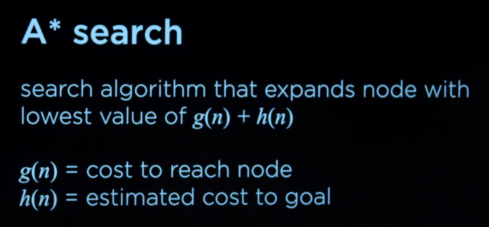

# Lec 1

[note](https://cs50.harvard.edu/ai/2023/notes/0/)

- 课程从传统AI开始介绍，本节是搜索算法。从下棋和华容道这样的游戏，到地图路径的规划，都可以建模成搜索问题。

## Search

- 对系统的各种可能的状态进行编码，这些状态作为节点就构成了图。研究怎样到达目标状态，转换成研究在图中寻找路线的问题。

- 课程具体描述了对问题建模以及代码实现的过程，包括怎样设计对象，怎样通过伪代码描述对象的方法。

- 在代码实现中，可以定义节点对象，存储可以到达的状态以及转移状态的动作和代价（等价于节点间的路程）等数据，以及相关的方法。还可以定义“当前搜索的状态”（Frontier）等对象。

- BFS和DFS，广度和深度优先搜索。广度搜索能确保找到最短路径，起点和终点相对较近的时候效率高。

- BFS和DFS是uninformed search，没有利用与问题相关的信息，比如终点的方位信息。

- GBFS（Greedy Best-First Search）用某种算法（Heuristic function）粗略估计节点与终点的距离，并总是先探索估计距离最短的节点。

- A* 搜索法考虑估计代价h与到达该节点已花费的代价的和。即一个估计距离较大，但是更近的分支，可能会被优先探索。

- 当满足条件：1. h总是小于等于实际代价；2. h+g随着前进只能不变或增加，A*能找到最优路线。（理解：h+g会从较小的值逼近路线的实际路程，非最短的路线终会被放弃）

### Adversarial Search

- 对于井字棋这样的对抗性游戏，需要不同的搜索算法，如Minimax。Minimax包含一个希望使结果得分最大的玩家和一个使其最小的玩家

- Minimx算法实际上递归遍历了某一步之后，所有可能的终盘，类似DFS
。

- Alpha-Beta pruning方法在检查完一个选项分支后，如果其他分支已经确定更差，就可以跳过该分支剩下的情况。

- 对更复杂的游戏，比如象棋，搜索到终盘的计算量过大，只能搜索一个有限的深度。此时需要一个评估算法，估计某种棋盘状态下玩家的得分。

## ProbSet 1

- degrees搜索通过演员-电影-演员的方式连接好莱坞的不同演员。这是一个计算量较大的搜索应用。参考课程给出的设计思路，使用字典存储图，用Node和Frontier类分别存储节点和前线节点。如果直接使用类和列表进行递归，程序用几分钟只能搜索数百步，而整个表有超过十万名演员，程序的内存占用和计算量都需要优化。优化的细节包括：
    1. 确保已经检查过的节点不会再被加入frontier。
    2. 使用集合存储已经检查过的节点，提高检索效率。
    3. 使用deque这样的双向链表结构，相比占用一块连续内存的list结构，双向链表队列能更高效地删除队列首个元素。
